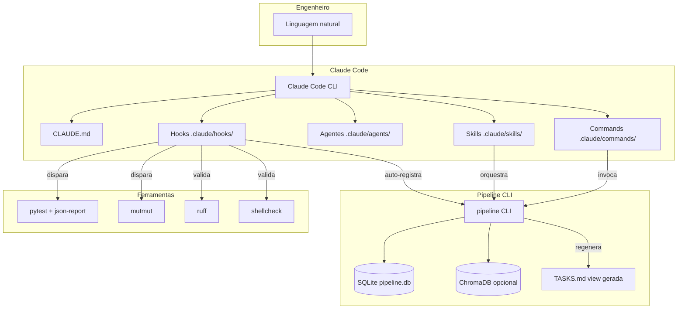
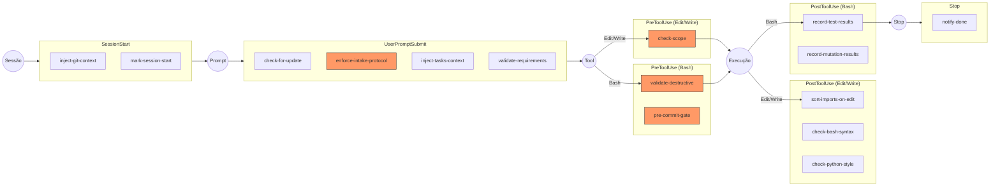
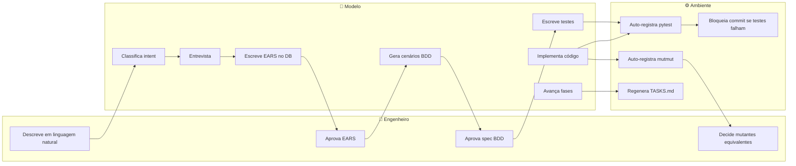
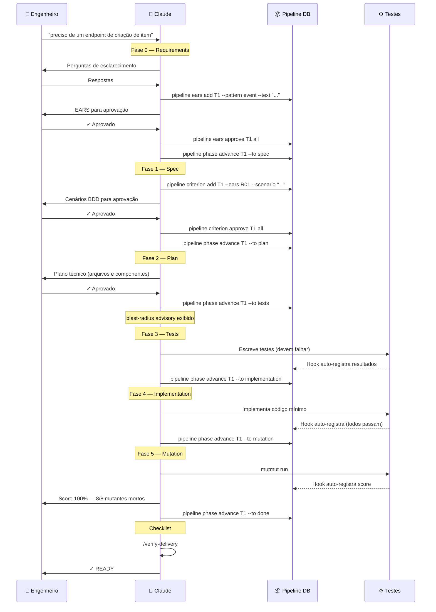
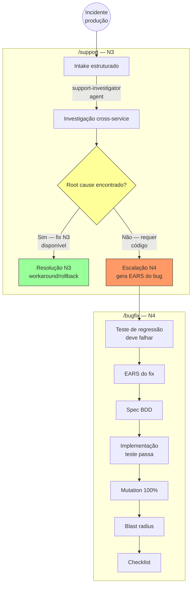
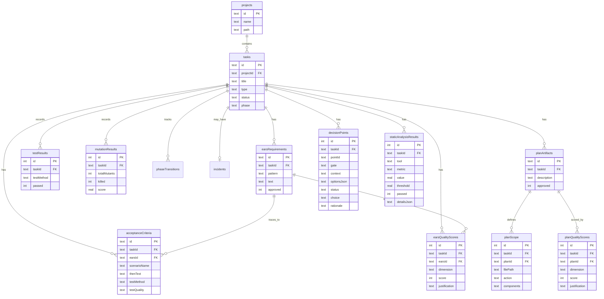
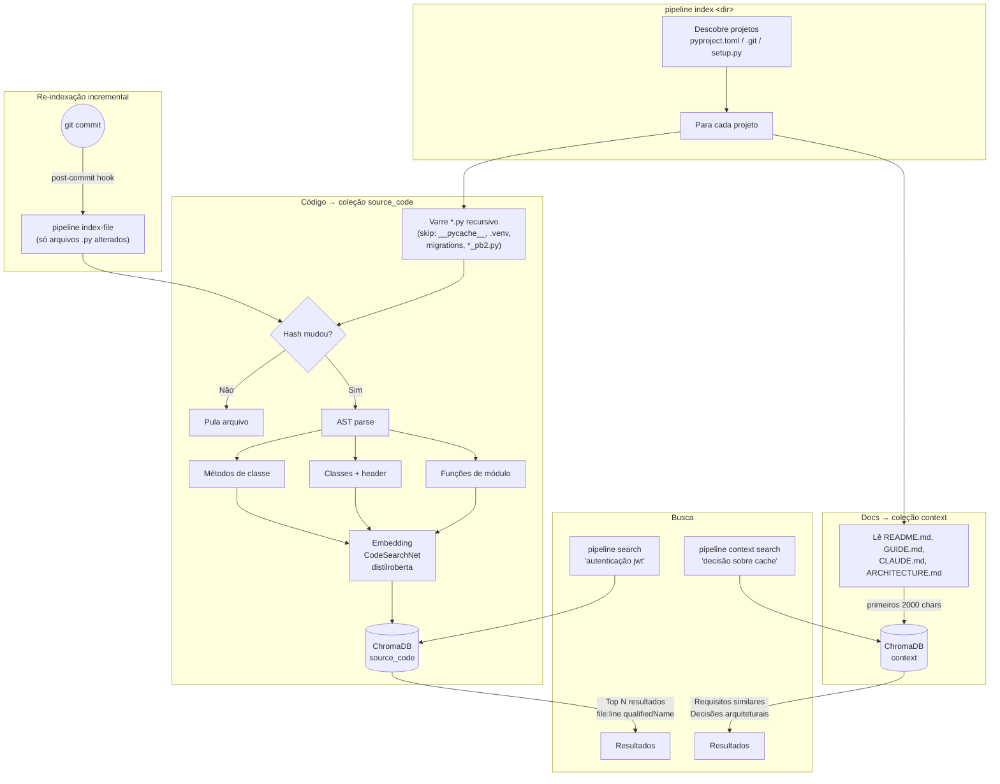
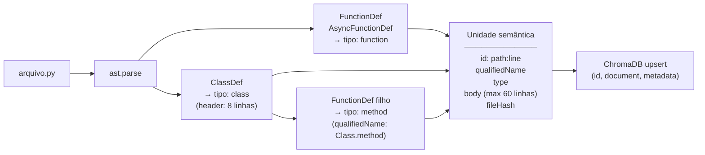

# Arquitetura do Ambiente

Diagramas visuais do ambiente Claude Code Engineering.

---

## 1. Visão Geral

---

## 2. Hook Lifecycle

> Hooks em laranja podem **bloquear** a operação (exit 2).

---

## 3. Pipeline EBTM

```mermaid
flowchart LR
    REQ[requirements]
    SPEC[spec]
    PLAN[plan]
    TESTS[tests]
    IMPL[implementation]
    MUT[mutation]
    SA[static-analysis]
    DONE[done]

    REQ -->|"EARS aprovados\nquality scores"| SPEC
    SPEC -->|"critérios aprovados\ntestMethods mapeados\nadversarial-reviewer libera"| PLAN
    PLAN -->|"plan aprovado\nblast-radius advisory"| TESTS
    TESTS -->|"qualidade ACCEPTABLE+\ntestes executados\nadversarial-reviewer libera"| IMPL
    IMPL -->|"todos os testes passando\nadversarial-reviewer libera"| MUT
    MUT -->|"score = 100%\nauto-invoca análise estática"| SA
    SA -->|"ruff/bandit/vulture/pylint = 0\nCC ≤ 10, MI ≥ 36"| DONE

    REQ -.->|"👤 Engenheiro aprova"| SPEC
    SPEC -.->|"👤 Engenheiro aprova\n+ resolve decisões"| PLAN
    PLAN -.->|"👤 Engenheiro aprova"| TESTS
    TESTS -.->|"👤 Resolve decisões"| IMPL
    IMPL -.->|"👤 Resolve decisões"| MUT
    MUT -.->|"👤 Decide equivalentes"| DONE
```

### Papéis por fase

---

## 4. Fluxo de Feature (/feature)

---

## 5. Fluxo de Incidente (/support → /bugfix)

---

## 6. Banco de Dados

---

## 7. Indexação Semântica

### Detalhes do AST

Cada arquivo Python é parseado via `ast` e decomposto em unidades semânticas:

